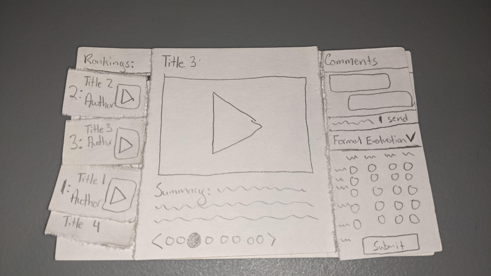
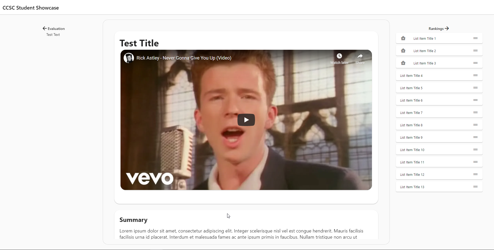

# Development Memo

## Build Week 1

I learned a few things throughout build week 1 that can be placed into two categories:

1. Things about flutter web
2. Things about prototyping

### Things about Flutter Web

I've been using Flutter for a mobile project recently and I think I've been spoiled by the sheer number of existing widgets that do exactly what I want them to do. Due to Flutter Web's beta state, there weren't as many available packages that I could just drop right in and expect to work.

For instance, when I made my prototype, I had assumed that there would be a package for Flutter Web that allowed for both horizontally expandable widgets and vertically expandable widgets. Unfortunately for me, I didn't end up finding something that did *exactly* what I wanted it to do, so I created my own ExpandableContainer widget.

After I got the ExpandableContainer widget coded, generified, and working how I wanted it to, I found myself battling with another issue, the scrolling wasn't smooth at all (unlike how smooth it is in the video).

The root of the issue was that the middle widget (featuring a very famous video and a few paragraphs of text) was expensive to compute, and attempting to animate it being resized caused the animation to stutter badly. I can't remember the exact way that I was representing the text displayed before, but I do know that I using a `Wrap` widget to wrap the text increased performance, and switching from a `Column` to a `ListView` with an inner `ListBody` also increased performance. Both of those changes were suggested from some Flutter documentation that I of course have lost at the time of writing this memo.

Recall that in my paper prototype, I originally had the ranking column position on the left of the screen. Something strange that I encountered while developing this week was that when the Ranking column, which consists of a `ListView->ListBody-><ListTile>[]`, was expanded, the other two Widgets would unnecessarily refresh their states and be redrawn. This was unfortunate because it had the unintended consequence of causing the video playback to stop, and the playback position to be set back to the beginning. I wanted to make judging as easy as possible, and this issue would've made it extremely annoying to judge and watch the video at the same time. Moving the ranking column to the right side of the screen fixed the issue for reasons I can only theorize about.

Something else that's unfortunate about the current state of Flutter Web is that there are still open issues that make life a bit difficult. My ranking column depends on drag and drop functionality, and there's an awesome widget [ReorderableListView](https://api.flutter.dev/flutter/material/ReorderableListView-class.html), that currently had a known issue that makes it unusable on Web.

### Things about prototyping

Prototyping is hard. It's hard for a number of reasons, but I realized this week that it's important to ensure that every feature is prototyped.

After I finished getting all the technical things working the way that I wanted to, I sat down and used my application. I pressed play on the video, and attempted to read the summary that is currently positioned under the video. At this moment I realized that with my current design it's not possible to both read the description of the project **and** watch the video at the same time, which presents some minor usability issues.

I also realized that in my prototype, I didn't account for the fact that I wanted both the left hand evaluation and the right hand ranking column to be able to expand and collapse. Because I didn't account for this in my prototype, I had to figure out whether I wanted the center column to stay in place when the side columns were hidden or whether I wanted it to be resized.

I can only hope that as I prototype more, I'll get better at testing every feature :)

## Week 1 Conclusion

I'm proud of where I'm currently at with the software, and I have a clear roadmap of where I'm headed.
